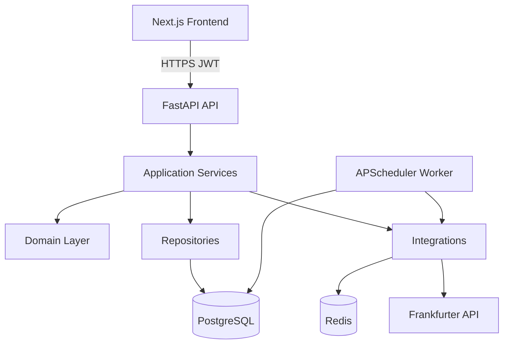
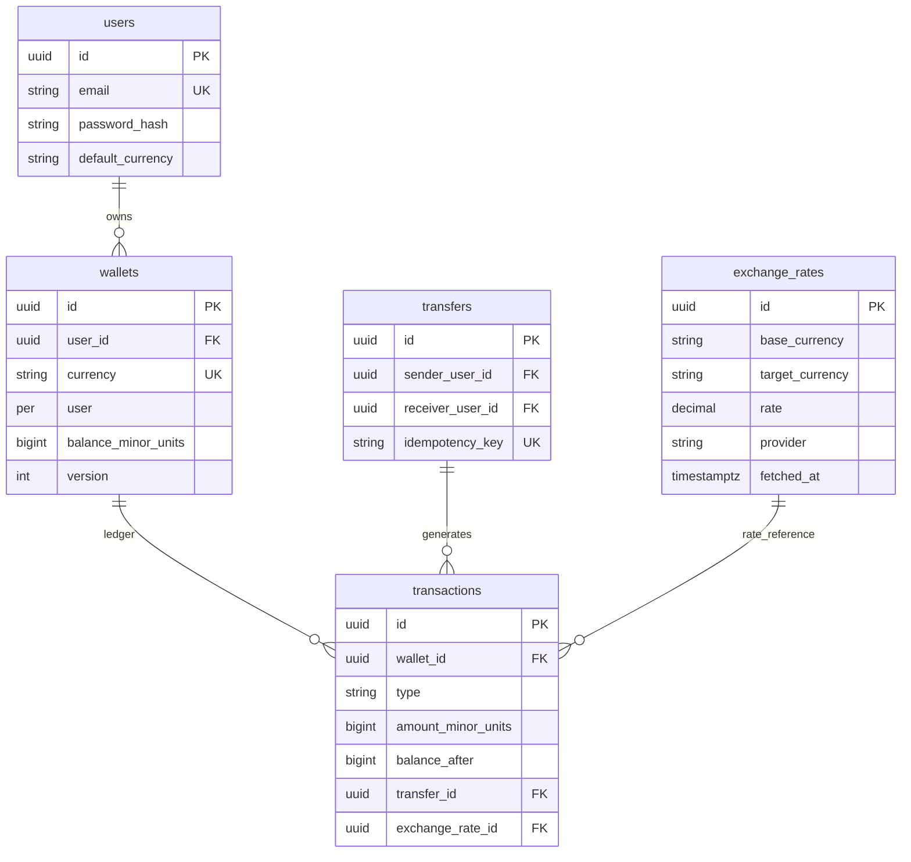
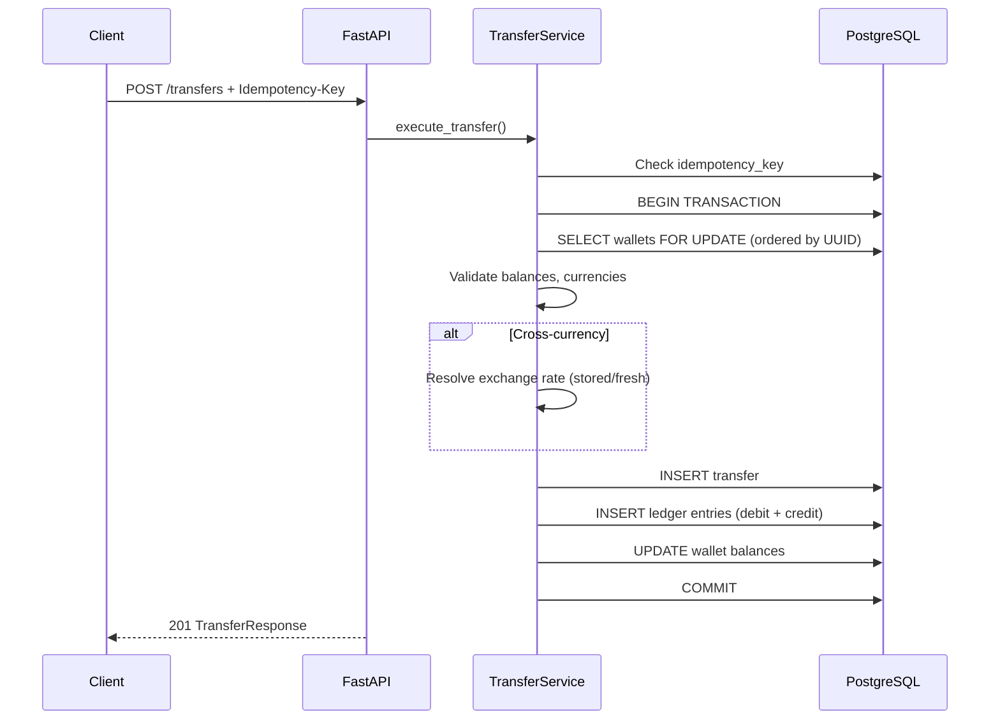
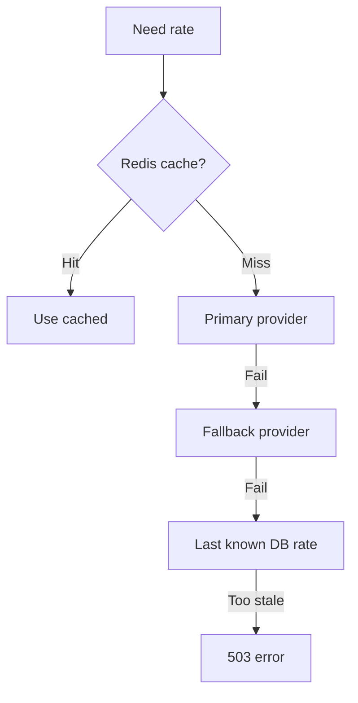

# Architecture

## System Overview



## Clean Architecture Layers

```
backend/app/
├── api/           # HTTP adapters — routes, status codes
├── schemas/       # Pydantic DTOs — API contracts
├── services/      # Use-case orchestration
├── domain/        # Business rules, value objects (no framework deps)
├── repositories/  # Persistence adapters
├── models/        # SQLAlchemy ORM (infrastructure)
├── integrations/  # External systems (exchange, Redis)
├── workers/       # Scheduled jobs
├── middleware/    # Cross-cutting request pipeline
└── core/          # Config, security, logging, exceptions
```

**Dependency rule:** Dependencies point inward. Domain never imports FastAPI or SQLAlchemy.

## Domain Model



### Invariants

- **Append-only ledger:** Transactions are never updated or deleted
- **Balance changes via transactions:** Every deposit, withdrawal, transfer, conversion creates ledger entries
- **Non-negative balances:** Enforced by domain rules + DB CHECK constraint
- **One wallet per (user, currency):** Unique constraint

## Data Flow: Transfer



### Consistency Controls

| Mechanism | Purpose |
|---|---|
| `SELECT ... FOR UPDATE` | Prevent concurrent double-spend |
| Deterministic lock ordering | Prevent deadlocks |
| DB transaction boundary | Atomic all-or-nothing |
| `idempotency_key` unique constraint | Safe retries |
| `CHECK (balance >= 0)` | DB-level safety net |
| Optimistic `version` column | Detect concurrent modifications |

## API Design

- REST JSON under `/api/v1`
- JWT Bearer authentication
- Consistent error format: `{ error: { code, message, details, request_id } }`
- Idempotency via `Idempotency-Key` header on transfers

## Security

| Control | Implementation |
|---|---|
| Password hashing | bcrypt (cost 12) |
| Authentication | JWT HS256, 15 min expiry |
| Authorization | All queries scoped to authenticated user |
| Rate limiting | Redis sliding window on login (5/15min) |
| Input validation | Pydantic v2 strict schemas |
| Secrets | Environment variables |

## Observability

### Logging
Structured JSON logs with `request_id`, `user_id`, and event types:
`auth.login`, `wallet.deposit`, `transfer.completed`, `conversion.executed`, `exchange.refresh`

### Health (`GET /health`)
Checks: database, Redis, exchange provider

### Metrics (`GET /metrics`)
Prometheus counters: `http_requests_total`, `http_request_duration_seconds`, `transfer_total`

### Error Rate Monitoring (documented)

| Alert | Condition |
|---|---|
| High 5XX | >2% over 5 minutes |
| 4XX spike | >2x 7-day baseline |
| Transfer failures | >10/min |
| Exchange provider down | >5 fetch errors in 5min |

Grafana dashboards: API overview, transfer SLA, exchange provider health.

## Scaling Strategy (500k users, 20k DAU, 100 TPS)

*Design only — not implemented in v1.*

### Horizontal Scaling
- Stateless FastAPI instances behind load balancer
- Separate worker instances for rate refresh
- JWT eliminates need for sticky sessions

### Database
- Primary for writes; read replicas for history queries
- PgBouncer connection pooling
- Index: `(wallet_id, created_at)` on transactions
- Partition `transactions` by month at >100M rows

### Caching (Redis)
- Exchange rate cache (TTL 1h)
- Login rate limit counters
- Optional idempotency dedup

### Async Processing
- Rate refresh via APScheduler → Celery/ARQ at scale
- Post-transfer notifications via message queue
- Nightly balance reconciliation job

### Provider Resilience


- Circuit breaker: 5 failures → open 60s
- `max_stale_age`: configurable per operation type

### Cost Optimization
- Read replicas over oversized primary
- Archive transactions >2 years to cold storage
- Redis reduces DB and API calls

### Operational Concerns
- SLO: 99.9% availability, transfer success >99.5%
- Runbooks for exchange outage, DB failover, elevated 5XX
- Blue/green deploys for zero-downtime migrations
